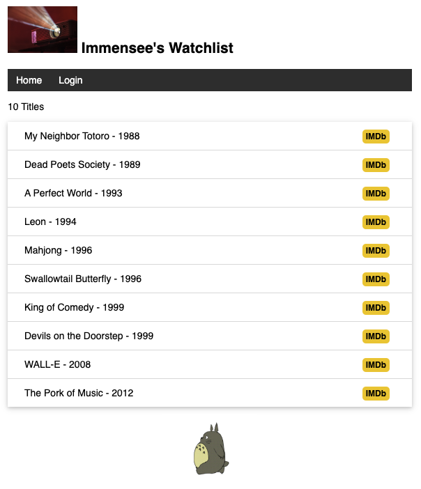
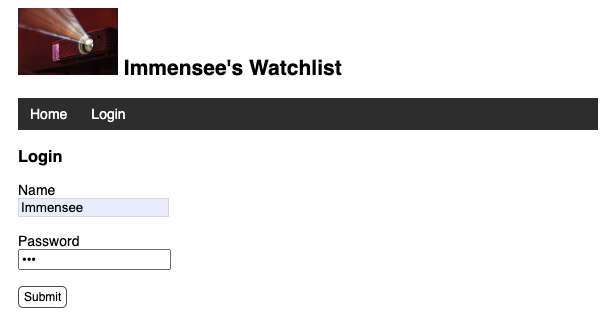
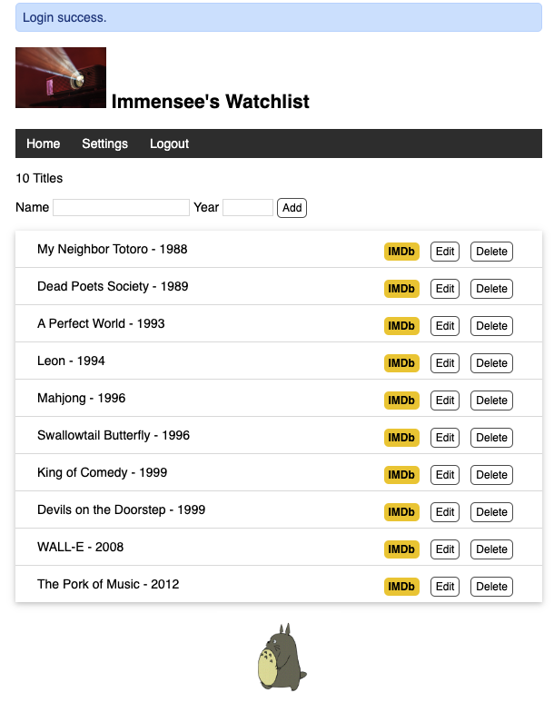
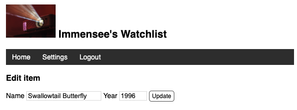

## Personalized Movie Watchlist
A web application built with Flask that helps movie enthusiasts keep track of their favorite films and movies they want to watch. This project demonstrates the implementation of a full-featured web application with user authentication, database management, and CRUD operations.

### Features
- User authentication system (register, login, logout)
- Create, read, update, and delete movie entries
- Personalized watchlist management
- Simple and intuitive user interface
- Secure password hashing
- Flask-SQLAlchemy integration for database management

### Technology Stack
- **Backend**: Python Flask
- **Database**: SQLite with Flask-SQLAlchemy
- **Authentication**: Flask-Login
- **Security**: Werkzeug security for password hashing
- **Frontend**: HTML, CSS, Bootstrap

### Demo
#### Default Page

#### User Login Page

#### Admin/User Interface

#### Add Movie to Watchlist



### Getting Started
1. clone
```
$ git clone https://github.com/dulcimer2022/Personalized-Movie-Watchlist.git
$ cd watchlist
```
2. Set up a virtual environment and install dependencies:
```
python -m venv env
source env/bin/activate  # On Windows: env\Scripts\activate
pip install -r requirements.txt
```
3. generate fake data:
```
(env) $ flask forge
* Running on http://127.0.0.1:5000/
```
4. update admin user
```
(env) $ flask admin
```
5. run the app:
```
(env) $ flask run
```


